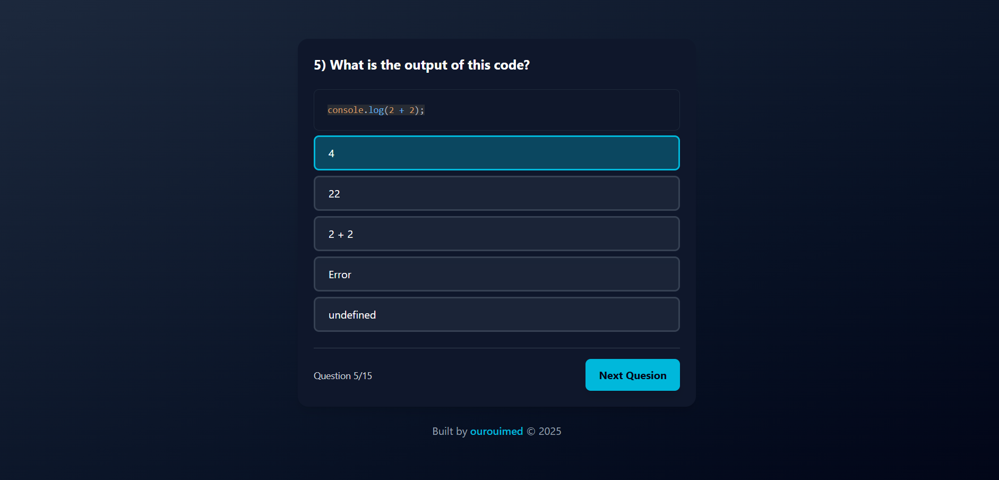

# Quiz App
AI Quiz Generator application built with **React** and **Vite**. with **Google Gemini AI APi** The app allows users to test their knowledge with interactive quizzes

## Features (v1.0.1 15/02/2025)
- **Dynamic Quizzes**: Load quizzes dynamically from user choice (quiz topic , quiz level and number of questions) using **Gemini Ai**
- **Responsive Design**: on desktops, tablets, and mobile devices.
- **Score Tracking**: Displays scores and progress at the end of quiz.
- **Fast and Optimized**: Built with Vite for faster builds and performance.

## Demo & Screenshots



Check out the live demo [here](https://ourouimed.github.io/react-quiz).

## Tech Stack

- **Frontend**: React, Vite
- **Styling**: Tailwind CSS 
- **State Management**: React hooks useState
- **AI Generator** : Gemini Api

## Installation

To run this project locally:

1. **Clone the repository**:
   ```bash
   git clone https://github.com/ourouimed/react-quiz.git
   cd react-quiz
   ```

2. **Install dependencies**:
   ```bash
   npm install
   ```

3. **Start the development server**:
   ```bash
   npm run dev
   ```

4. Open your browser and visit: `http://localhost:5173`

## File Structure
```
react-quiz/
├── public/             # Static assets 
    └── assets /        # Project screenShots
├── src/                # Quiz data 
│   ├── App.jsx         # Main app component
│   ├── main.jsx        # React entry point
│   ├── questions.js    # Questions data
│   └── index.css       # Tailwindcss styles
├── .gitignore          # Git ignore rules
├── index.html          # Main HTML file
├── package.json        # NPM configuration
├── README.md           # Project documentation
├── vite.config.js      # Vite configuration
└── eslint.config.js    # Eslint configuration
```

## How to Generate a quiz (New 15/02/2025)?
1. On the home page, enter the topic you want to generate a quiz about in the input field.
2. Select the quiz difficulty level (Easy, Medium, Hard).
3. Choose the number of questions (between 5 and 30).
4. Click "Generate Quiz" and start testing your knowledge!